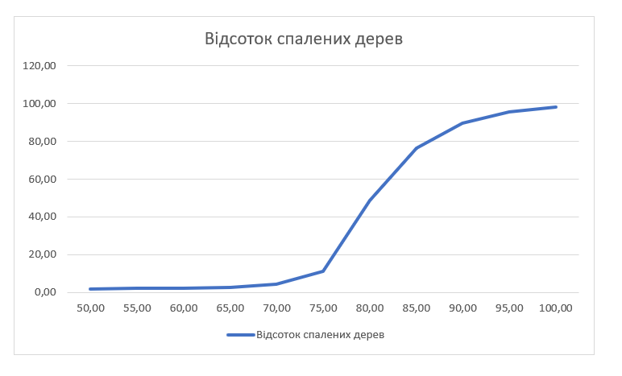
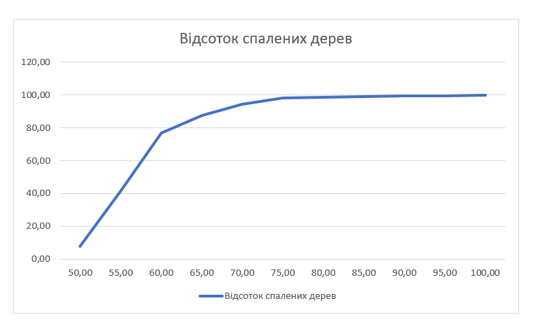
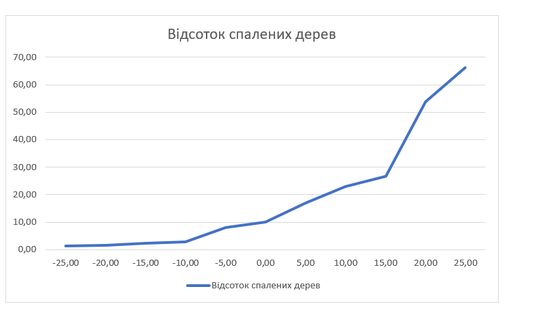

## Комп'ютерні системи імітаційного моделювання
## СПм-22-4, **Гаращенко Ярослав Володимирович**
### Лабораторна робота №**1**. Опис імітаційних моделей та проведення обчислювальних експериментів

 

### Варіант 5, модель у середовищі NetLogo:
[Fire Simple Extension 2](http://www.netlogoweb.org/launch#http://www.netlogoweb.org/assets/modelslib/IABM%20Textbook/chapter%203/Fire%20Extensions/Fire%20Simple%20Extension%202.nlogo)

 

### Вербальний опис моделі:
Цей проект моделює поширення вогню в лісі, враховуючи вплив густоти дерев. Це служить прикладом загальної особливості складних систем, яка полягає в наявності нелінійного порога чи критичного параметра. Ця модель є розширенням Fire Simple Extension 1, враховуючи вплив вітру на процес. Пожежа починається на лівому узліссі та поширюється на сусідні дерева. Вогонь поширюється на чотирьох напрямах: північ, схід, південь і захід.

### Керуючі параметри:
- **density** повзунок контролює щільність дерев у лісі.
- **probability-of-spread** повзунок впливає на ймовірність поширення вогню від ділянки до ділянки з деревами.
- **south-wind-speed** повзунок впливає на те, наскільки сильний вітер з півдня. Можна встановити негативне значення, щоб створити північний вітер.
- **west-wind-speed** повзунок впливає на те, наскільки сильний вітер з заходу. Можна встановити негативне значення, щоб створити східний вітер.

### Внутрішні параметри:
- **initial-trees** зберігає в собі кількість дерев в моделі.

### Показники роботи системи:
- **percent burned** монітор на якому написано скільки відсотків дерев згоріло.
  
### Примітки:
Вітер в, залежності від його напрямку, може збільшити або зменшити вірогідність розпосюдження вогню.
  
### Недоліки моделі:
Вогонь завжди починається з лівого краю лісу однією великою полосою. Але в реальному житті вогонь може виникнути в будь якому місці лісу. Ще ландшафт запростий. Зазвичай в лісі бувають галявини без дерев, місця з різною щільністю дерев та річки і ручійки.
 

## Обчислювальні експерименти
### 1. Вплив щільності дерев на відсоток спалених дерев
Досліджується залежність кількості спалених дерев від щільності дерев протягом певної кількості тактів (поки вогонь не погасне. ~30-300 тактів).
Експерименти проводяться при 50-100% щільності дерев, з кроком 5%, усього 11 симуляцій.  
Інші керуючі параметри мають значення за замовчуванням:
- **probability-of-spread**:57%
- **south-wind-speed**:25
- **west-wind-speed**:25
<table>
<thead>
<tr><th>Щільність дерев</th><th>Відсоток спалених дерев</th></tr>
</thead>
<tbody>
<tr><td>50</td><td>1.8</td></tr>
<tr><td>55</td><td>2.3</td></tr>
<tr><td>60</td><td>2.3</td></tr>
<tr><td>65</td><td>2.7</td></tr>
<tr><td>70</td><td>4.4</td></tr>
<tr><td>75</td><td>11.3</td></tr>
<tr><td>80</td><td>48.9</td></tr>
<tr><td>85</td><td>76.5</td></tr>
<tr><td>90</td><td>89.7</td></tr>
<tr><td>95</td><td>95.7</td></tr>
<tr><td>100</td><td>98.0</td></tr>
</tbody>
</table>

 За даними можна побачити, що зі збільшенням щільності дерев з 50% до 100%, відсоток спалених дерев також зростає від 1.8% до 98.0%. Це може вказувати на те, що щільніше розташовані дерева сприяють поширенню вогню. При щільності дерев від 80% і вище відсоток спалених дерев значно зростає. 
 
### 2. Вплив шансу розпосюдження вогню на відсоток спалених дерев
Досліджується залежність кількості спалених дерев від шансу розпосюдження вогню протягом певної кількості тактів (поки вогонь не погасне. ~30-300 тактів).
Експерименти проводяться при 50-100% шансу розпосюдження вогню, з кроком 5%, усього 11 симуляцій.  
Інші керуючі параметри мають значення за замовчуванням:
- **density**:82%
- **south-wind-speed**:25
- **west-wind-speed**:25
  
<table>
<thead>
<tr><th>Шанс розпосюдження вогню</th><th>Відсоток спалених дерев</th></tr>
</thead>
<tbody>
<tr><td>50</td><td>7.7</td></tr>
<tr><td>55</td><td>41.4</td></tr>
<tr><td>60</td><td>77.0</td></tr>
<tr><td>65</td><td>87.5</td></tr>
<tr><td>70</td><td>94.2</td></tr>
<tr><td>75</td><td>98.2</td></tr>
<tr><td>80</td><td>98.4</td></tr>
<tr><td>85</td><td>99.0</td></tr>
<tr><td>90</td><td>99.3</td></tr>
<tr><td>95</td><td>99.5</td></tr>
<tr><td>100</td><td>99.7</td></tr>
</tbody>
</table>

З даних видно, що зі збільшенням шансу розпосюдження вогню зростає відсоток спалених дерев.Також при шансі розпосюдження вогню вже в межах 75-80%, відсоток спалених дерев практично максимальний, і подальше збільшення шансу майже не впливає на результат.

### 3. Вплив сили західного та східного вітрів  на відсоток спалених дерев
Досліджується залежність кількості спалених дерев від сили західного та східного вітрів протягом певної кількості тактів (поки вогонь не погасне. ~30-300 тактів).
Експерименти проводяться при -25 - 25 сили західного вітру, з кроком 5, усього 11 симуляцій.  
Інші керуючі параметри мають значення за замовчуванням:
- **density**:82%
- **probability-of-spread**:57%
- **south-wind-speed**:25
  
<table>
<thead>
<tr><th>Сила західного вітру</th><th>Відсоток спалених дерев</th></tr>
</thead>
<tbody>
<tr><td>-25</td><td>1.2</td></tr>
<tr><td>-20</td><td>1.5</td></tr>
<tr><td>-15</td><td>2.3</td></tr>
<tr><td>-10</td><td>2.7</td></tr>
<tr><td>-5</td><td>8.0</td></tr>
<tr><td>0</td><td>10.0</td></tr>
<tr><td>5</td><td>16.9</td></tr>
<tr><td>10</td><td>23.0</td></tr>
<tr><td>15</td><td>26.6</td></tr>
<tr><td>20</td><td>53.7</td></tr>
<tr><td>25</td><td>66.2</td></tr>
</tbody>
</table>

З аналізу даних можна зробити висновок, що східний вітер має менший вплив, але сильний західний вітер може суттєво збільшити розповсюдження пожежі. Це може бути пов'язано з напрямком розповсюдження вогню та його взаємодією з іншими параметрами.
